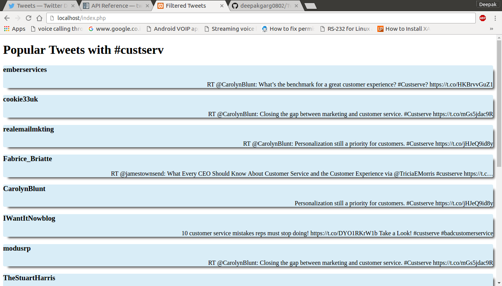

# Tweet API Client

This repository consists of a [Desktop Application](https://github.com/deepakgarg0802/TweetAPIClient#usage-of-desktop-application) which doesnt need a browser and a [Web Application](https://github.com/deepakgarg0802/TweetAPIClient#usage-of-web-application). These Applications will fetch the tweets from Twitter which contain hashtag : `#custserve` and are tweeted atleast once.

Click [here](https://github.com/deepakgarg0802/TweetAPIClient#usage-of-desktop-application) for Desktop Application

Click [here](https://github.com/deepakgarg0802/TweetAPIClient#usage-of-web-application) for Web Application

## Usage of Desktop Application

### Installation of Packages

This requires python, Tweepy library.
* Install Python

On Mac/Linux
Python comes pre-installed in most Linux & Unix OS.

Windows
[Download Python](https://www.python.org/downloads/)

* Install Tweepy

On Mac/Linux/Windows
`sudo pip install tweepy --local` 
If you don't have pip installed, `sudo easy_install pip`

* Install Tkinter

On Mac/Linux/Windows
Tkinter comes pre-installed in most Python versions. If yo are having problems in importing this package, reinstall python.

### Prerequisites
Create a twitter app at https://apps.twitter.com/, and make sure you have your CONSUMER_KEY and CONSUMER_SECRET ready.Place those keys and tokens in .twitter file of whichever application you are using

### Running the App
* To use the app, Download [this](https://github.com/deepakgarg0802/TweetAPIClient/tree/master/Desktop%20Application) folder. Navigate to this folder in terminal and run `python Desktop App.py`
* Click on Refresh button to load the tweets
* Double click on any tweet to see its Json url. You can download details by visiting that url

-----------------------------------------------------------------------------------------------------------
------------------------------------------------------------------------------------------------------------
## Usage of Web Application

This requires php supported server. The app is properly running on xampp with python installed on machine.
### Installation of Packages

This requires python, Tweepy library.
* Install Python

On Mac/Linux
Python comes pre-installed in most Linux & Unix OS.

Windows
[Download Python](https://www.python.org/downloads/)

* Install Tweepy

On Mac/Linux/Windows
`sudo pip install tweepy --local` 
If you don't have pip installed, `sudo easy_install pip`

### Prerequisites
Create a twitter app at https://apps.twitter.com/, and make sure you have your CONSUMER_KEY and CONSUMER_SECRET ready.Place those keys and tokens in .twitter file of application.

### Running the App
* To use the app, Download [this](https://github.com/deepakgarg0802/TweetAPIClient/tree/master/Web_app) folder. Copy the contents of this folder to your server folder (e.g. /opt/lampp/htdocs)
* start server
* open `localhost/twitter.php` in browser
* Note : the server should have permission to access tweepy package and python

